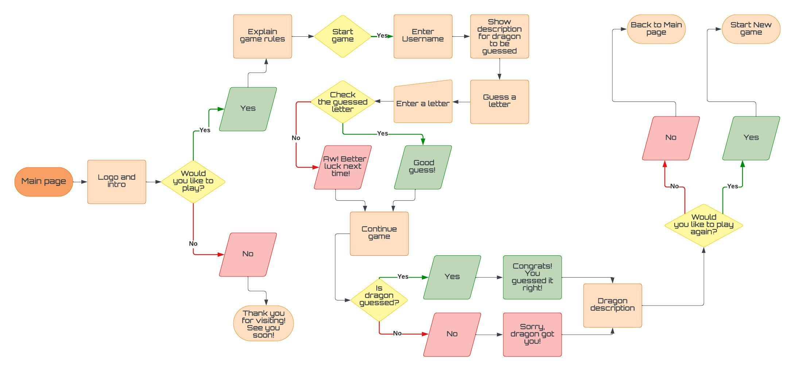

# **Dragons**

## **Overview**

Guess the name of the mysterious dragon in this exciting terminal-based word guessing game! You'll be presented with a hidden dragon name, and your task is to reveal the name one letter at a time. With a limited number of incorrect guesses, can you unveil the dragon's identity and discover the secrets it holds? A fun and challenging adventure awaits as you uncover the name of the enigmatic dragon while enjoying the thrill of the hunt. Prepare to test your word-solving skills! 

## Table of Contents:
- [**Dragon Guessing Game**](#dragon-guessing-game)
  - [**Overview**](#overview)
  - [Table of Contents:](#table-of-contents)
  - [**Planning**](#planning)
    - [**Intended Users**](#intended-users)
    - [**User Stories**](#user-stories)
    - [**Goals**](#goals)
    - [**Lucidchart**](#lucidchart)
  - [**Features**](#features)
    - [**Favicon**](#favicon)
    - [**Logo**](#logo)
  - [**Testing**](#testing)
  - [**Deployment**](#deployment)
  - [**Credits**](#credits)
    - [**Content**](#content)
    - [**Media**](#media)
  - [**Future development**](#future-development)

## **Planning**

### **Intended Users**

* Anyone who loves a guessing game.
* Anyone with interest in dragons.
* People who are looking for fun with added challenge.

### **User Stories**

* As a user, I want to know the main intention of the site.
* As a user I want to see the game rules clearly written.
* As a user I want to play puzzle without compromising space.
* As a user I want to be able to navigate through the site easily.

### **Goals**

* Make game easy to navigate through.
* Provide a free guessing game.
* Provide simple and short rules of the game.
* Educate user about different dragons and provide a short description of each.

### **Lucidchart**

I created a flowchart using [Lucidchart](https://lucid.co/?_gl=1*x824jw*_ga*MTQ0OTcxNjc5Ni4xNjk3NTYwMDUx*_ga_MPV5H3XMB5*MTY5NzYyMzg3Ny4zLjAuMTY5NzYyMzg3Ny42MC4wLjA.) website to help with a flow of the game. 

## **Features**

### **Favicon**

I originally created favicon using a vector from [Vecteezy](https://www.vecteezy.com/) website with an idea to recreate the look of a dragon eye and used [Faviconer](http://www.faviconer.com/) website to change it into favicon but soon after realized [Heroku](https://www.heroku.com/) doesn't host static files. During session with my mentor he explained how to use web hosted image so I used [Google](https://www.google.com/) to search for dragon's eye, I chose one from [Deviant Art](https://www.deviantart.com/christoskarapanos/art/Dragon-s-Eye-585971591) and added it succesfully to my project.

### **Game intro**

### **Username entry / rules question**

### **Username error messages**

### **Rules**

### **Guess messages**

### **Game won / lost**

### **Thank You message**

### **Dragon ASCII art**

## **Testing**

I have included details of testing in a separate file [TESTING.md](TESTING.md).

## **Deployment**

### Deploying to Heroku

Code Institute Python Essentials Template was used for this project so the python code can be viewed in a terminal in a browser:
1. Google Heroku and open website, log in to Heroku or create a new account
2. On the dashboard click "New" and select "Create new app"
3. Enter unique app name and select region
4. Click "Create app"
5. On the next page find "Settings" tab and locate "Config Vars"
6. Click "Reveal Config Vars" and add "PORT" as a key and with value "8000", click "Add"
7. Scroll down to "Buildpack" and click "Add", select "Python" first
8. Repeat step 7. to add "Node.js", making sure "Python" is first on the list
9. Scroll to the top and select "Deploy" tab
10. Select GitHub as deployment method and search for your repository, once found click "Connect"
11. Scroll down and choose between "Enable Automatic Deploys" so the code is updated every time it is pushed to Github or "Manual Deploy"
12. Deployed site accesible through this link [Dragons](https://dragon-guessing-game-d41047f8049b.herokuapp.com/)

## **Acknowledgments and Credits**

* Image for background taken from [Freepik](https://www.freepik.com/), owner [stockgiu](https://www.freepik.com/free-ai-image/majestic-dragon-perched-mountain-peak-overlooking-breathtaking-landscape-generated-by-ai_47589515.htm)
* Ascii art for game intro made with [Ascii](https://www.ascii-art-generator.org/)
* Ascii art for dragon image taken from [Ascii Art](https://www.asciiart.eu/mythology/dragons) created by Gunnar Z
* Image for Favicon taken from Deviant Art [Christos Karapanos](https://www.deviantart.com/christoskarapanos/art/Dragon-s-Eye-585971591)
* For code ideas and issues I used [W3 Schools](https://www.w3schools.com/python/default.asp), [Stack Overflow](https://stackoverflow.com/questions/tagged/python) and [Github](https://github.com/search?q=name%20guessing%20game&type=repositories) to search for other project to see how terminal can be moved from original position
* Dragon names and descriptions taken from several sources:
  * [Pathfinder Wiki](https://pathfinderwiki.com/wiki/Pathfinder_Wiki)
  * [Wikipedia](https://en.wikipedia.org/wiki/Dragon)
  * Dr. Ernest Drake "Dragonology" The complete book of dragons

* The biggest thank you as always to my family during this busy time of juggling project, hackathon and life in general.
* Thank you as well to my mentor David Bowers who supported me from the very beginning always giving the best advice and ideas for solutions.
* And thank you to Kim for continuous support and in general for convincing me to take on this course.

## **Future development**

* In future I would like to add sound effects, such as dragon roars and possibly create ASCII art matching each dragon description.