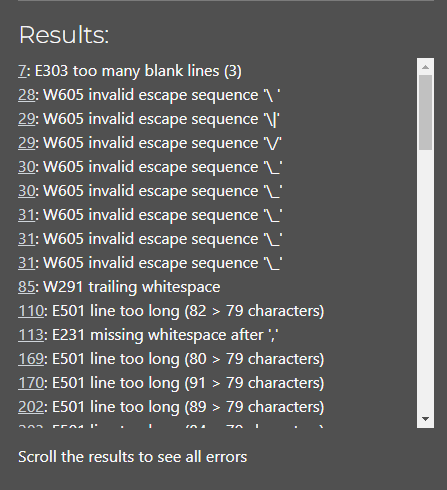
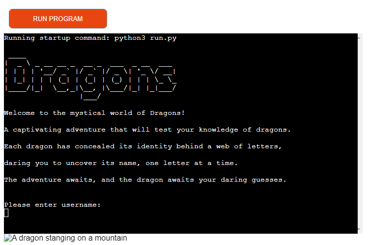
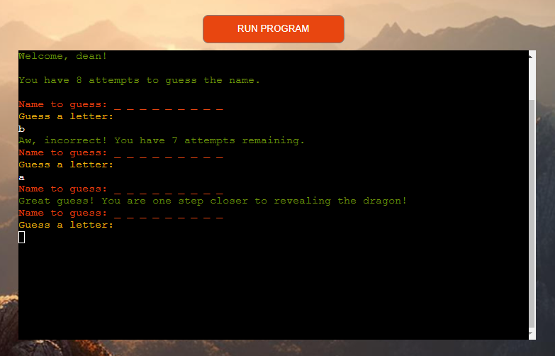
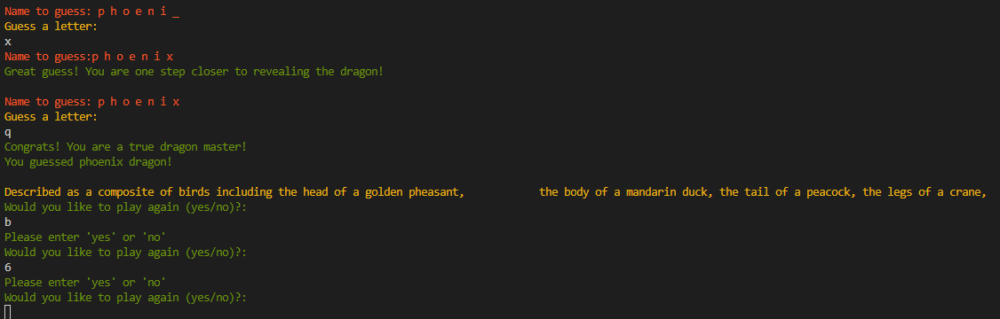
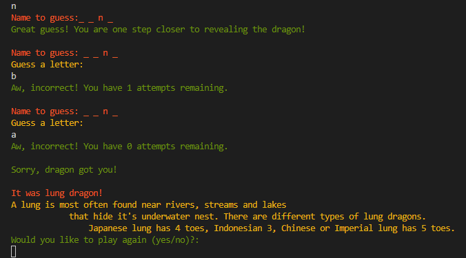
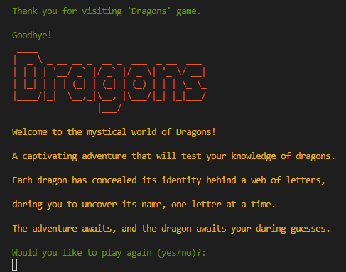
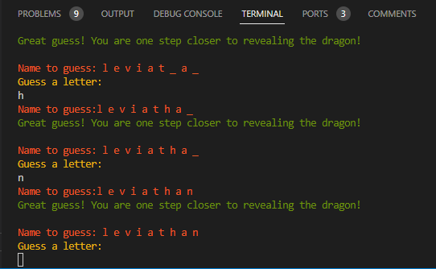

# Testing Page

## **Table of Contents**

## **Manual testing**
I manually tested this project several ways:
### **PEP8 Linter**
It showed a lot of errors, most being too many characters in line that was easily fixed by creating additional lines for text. Couple were accidental extra blank lines or whitespaces. Here is the screenshot of first check with CI provided Linter: 

### **Playing game**
I played the game countless times both in VSCode terminal and deployed version to fix all bugs and make sure there are no errors found. Additionally it helped with choosing colors and adding ASCII images to make game more appealing.

## **Bugs and fixes**
* ***Intended Outcome***

    Added background image to make game more appealing to user

    **Problem**

    After adding background image and creating CSS properties for it, I noticed it wasn't showing up in deployed app, only in live server in VSCode. 
    

    **Reason**

    After a quick Google, Slack search, remembering my first hackathon with the same issue and a chat with my mentor, I knew Heroku doesn't host static files.

    **Solution**

    My mentor suggested couple of ways and introduced me to [Cloudinary](https://cloudinary.com/) as a way to add web hosted background which was the way I solved the issue.

* ***Intended Outcome***

    Letter placements for each letter in dragon name beside "Name to guess".

    **Problem**

    One single placement for all letters.

    **Reason**

    No blank spaces between placements in function.

    **Solution**

    Created variable display_with_spaces to add blank spaces between placements.

* ***Intended Outcome***

    After a letter is guessed correctly in game, replace placement with guessed letter in correct possition.

    **Problem**

    Guessed letter printed under Guess a letter line not beside Name to guess, replacing placement in correct position.
    

    **Reason**

    No function created to replace placement with letter.

    **Solution**

    I created function display_with_guessed_letters that iterates through dragon name to be guessed and replaces placement with guessed letter.

* ***Intended Outcome***

    A short dragon description at the end of the game.

    **Problem**

    

    **Reason**

    As dragon descriptions were too long for one line, I have to split them in multiple lines. In my first try, I chose "\" and it caused gap between the text, instead of creating a continuous line.

    **Solution**

    To resolve it, I used "\n" and wrapped each line in quotation marks.

* ***Intended Outcome***

    Evenly aligned dragon descriptions.

    **Problem**

    Indendation in dragon description lines.
    

    **Reason**

    I had quotation marks only at the beginning and end of each description.

    **Solution**

    Made sure all indentation is equal and each line has quotation marks.

* ***Intended Outcome***

    After user chooses not to play again, game switches to game intro and asks for username again.

    **Problem**

    No username entry question.
    

    **Reason**

    I didn't call for username entry in my exit_game function.

    **Solution**

    A simple call for enter_username() in my exit_game function solved this.

* ***Intended Outcome***

    A short congratulations message  after dragon name has been guessed correct.

    **Problem**

    Instead of showing congratulations message straight after the last letter was guessed in the name, it allowed user to make another incorrect guess before congratulating.
    

    **Reason**

    Incorrect indentation in loop.

    **Solution**

    Once I fixed indentation in loop, game worked as intended.

## **Validators**

#### **HTML** : https://validator.w3.org/
No errors were found when checking HTML part of code.

#### **CSS** : https://jigsaw.w3.org/css-validator/

#### **PYTHON** : https://pep8ci.herokuapp.com/#
